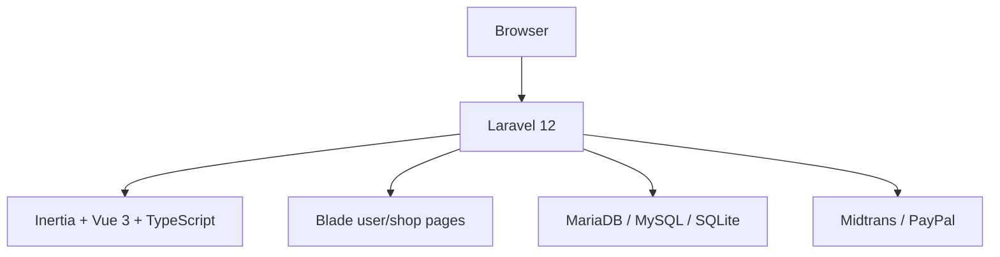
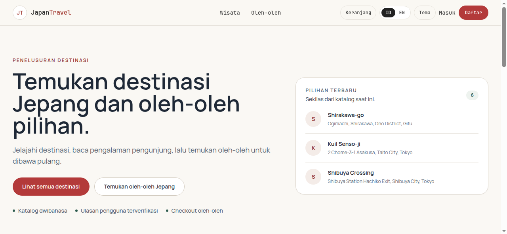
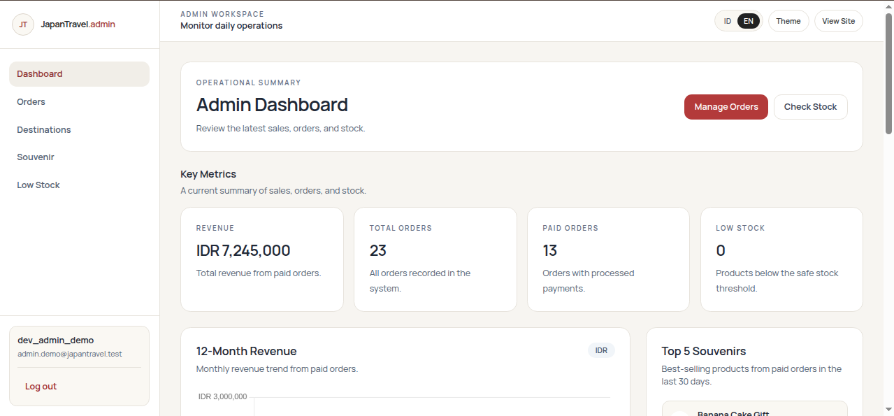
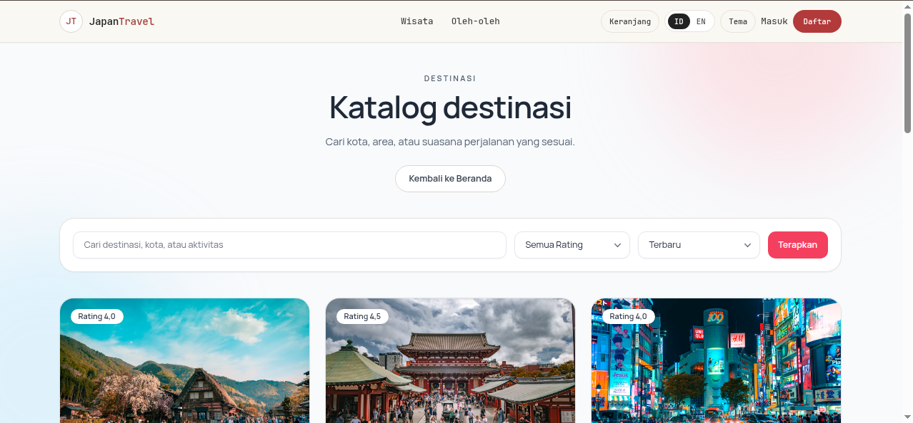
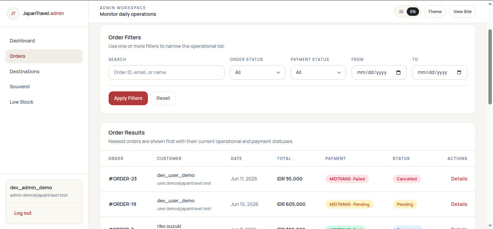
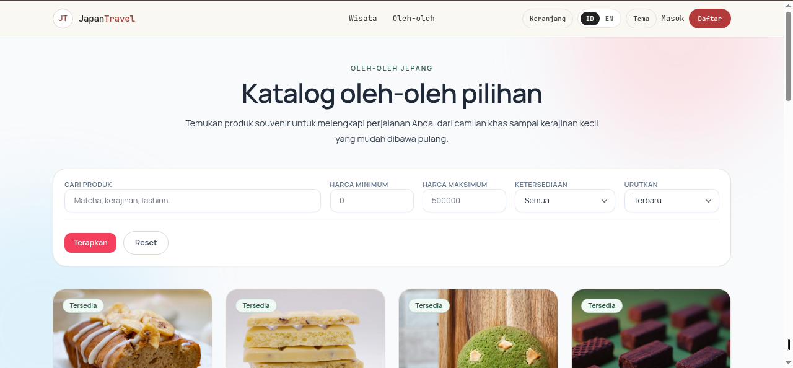
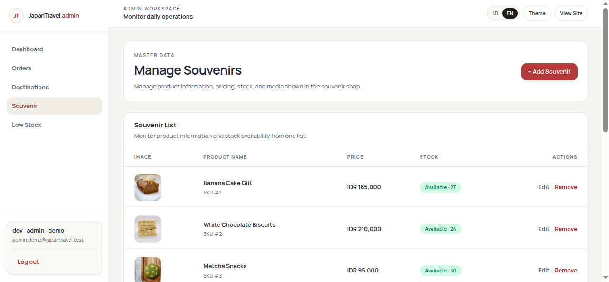

# Japan Travel

[](https://github.com/sulujulianto/japanesetravel/actions/workflows/ci.yml)
[](https://github.com/sulujulianto/japanesetravel/actions/workflows/security.yml)
[](https://www.php.net/)
[](https://laravel.com/)
[](https://vuejs.org/)
[](LICENSE)

[Bahasa Indonesia](README.md) · **English**

Japan Travel is a full-stack reference application for discovering destinations in Japan and purchasing souvenir products. It is built as a modern monolith with Laravel, Inertia, Vue, TypeScript, and MariaDB, with particular attention to transaction consistency, payment security, user/admin access isolation, and verifiable engineering evidence.

Travel services are limited to **information and optional WhatsApp inquiries**. The application does not sell tickets or process travel bookings. Checkout and payment apply only to souvenir products.

## Portfolio Status

| Area | Status |
|---|---|
| Local demo | Reproducible with a curated dataset |
| Automated quality gates | Passed on commit `b2cff65` |
| PHPUnit | 258 tests, 2,498 assertions |
| Database CI | SQLite, MariaDB 10.11, and MariaDB 11.8 |
| Screenshots | 15 views available in [`docs/screenshots`](docs/screenshots) |
| Public deployment | Deferred; the application is not presented as production-live |
| Payment providers | Integration structure and automated tests are available; external sandbox-account validation is not claimed |

This repository is positioned as a **production-oriented portfolio project**, not as evidence of real users or production transactions. Operational limitations are intentionally documented.

## Highlights

### Public and customer experience

- Bilingual Indonesian/English destination catalog with search, filtering, sorting, schedules, and detail pages.
- Verified-user reviews with duplicate protection at both application and database levels.
- Souvenir catalog, session cart, checkout, payment retry, and order history.
- Customer profiles and multiple shipping addresses with default-address selection.
- Responsive light/dark interfaces and locale-aware number, date, and price formatting.

### Admin operations

- Admin authentication and session context isolated from customer sessions.
- Operational dashboard for revenue, orders, stock, destinations, souvenirs, and users.
- Destination and souvenir CRUD with media validation, WebP conversion, dimension limits, and restricted deletion paths.
- Filterable orders with state transitions constrained by domain rules.
- Auditable inventory ledger for restock, deduction, reservation, and restoration events.
- Read-only user directory with relevant profile, address, and order information.

### Transaction and payment integrity

- Row locking and checkout tokens to reduce overselling and duplicate submissions.
- Midtrans Snap and PayPal Checkout behind a shared gateway contract.
- Webhook signature verification, event idempotency, and guarded state transitions.
- Amount, currency, and capture-reference validation before financial transitions.
- Exactly-once inventory restoration for terminal payment failures and administrative cancellation.
- Product, customer, and encrypted shipping snapshots that preserve readable order history when source data changes or an account is deleted.
- Bounded, redacted provider payloads with an explicit retention policy.
- Native backed enums for order, payment, webhook, provider, and user-role states.

## Architecture



The frontend follows an intentional, incremental **hybrid architecture**:

- The public home page and all admin modules use Inertia, Vue 3 Composition API, and TypeScript.
- Catalog, customer authentication, cart, checkout, orders, and profiles still use Blade.
- Both paths share the same backend brand, locale, theme, and domain rules.
- Modules are migrated with contract tests instead of using a high-risk all-at-once rewrite.

Key architectural decisions:

- `app/Services/Payments/` isolates provider behavior behind shared interfaces and drivers.
- `app/Enums/` owns persisted state values and transition rules.
- Separate guards and cookie names keep customer and admin login contexts independent.
- Inventory mutations are centralized in database transactions and an inventory ledger.
- Encrypted snapshots decouple transaction history from mutable profile data.
- `app/Support/Format.php`, `Media.php`, and `Brand.php` centralize presentation concerns shared across frontends.

See [Backend Technical Documentation](docs/backend-technical-documentation.md) for detailed data flows and state transitions.

## Technology

| Layer | Technology |
|---|---|
| Backend | PHP 8.3, Laravel 12 |
| Modern frontend | Inertia.js 3, Vue 3.5, TypeScript 5.9 |
| Server-rendered frontend | Blade and isolated legacy JavaScript |
| Styling and build | Tailwind CSS 3, Vite 7 |
| Database | MariaDB/MySQL; SQLite for quick review and the CI quality job |
| Payments | Midtrans PHP SDK, PayPal REST integration |
| Optional observability/cache | Sentry Laravel, Predis |
| Testing and analysis | PHPUnit 11, Larastan/PHPStan level 6, Pint, ESLint, vue-tsc |
| CI and security | GitHub Actions, CodeQL, dependency review, secret scan, Composer/npm audit |
| Packaging | Multi-stage Dockerfile and Railway configuration assets |

Locked versions are recorded in `composer.lock` and `package-lock.json`. The badges summarize the stack; they do not claim that every dependency always tracks the newest major release.

## Visual Evidence

| Public experience | Admin operations |
|---|---|
|  |  |
|  |  |
|  |  |

The complete 15-view set, including checkout, mobile, and dark-mode evidence, is listed in the [screenshot guide](docs/screenshots/README.md).

## Local Setup

### Requirements

- PHP 8.3 or newer
- Composer 2
- Node.js 20 or newer and npm
- MariaDB/MySQL, or SQLite for a quick review
- PHP extensions: `pdo_mysql` or `pdo_sqlite`, `gd` with WebP, `fileinfo`, `curl`, `mbstring`, `openssl`, `xml`, and `zip`
- `intl` is recommended; formatting has a deterministic fallback

### Installation

```bash
git clone https://github.com/sulujulianto/japanesetravel.git
cd japanesetravel

composer install
npm ci
cp .env.example .env
php artisan key:generate
```

For MariaDB/MySQL, create a database and update `.env`:

```env
DB_CONNECTION=mysql
DB_HOST=127.0.0.1
DB_PORT=3306
DB_DATABASE=japantravel
DB_USERNAME=root
DB_PASSWORD=
```

SQLite alternative for a quick review:

```bash
touch database/database.sqlite
```

```env
DB_CONNECTION=sqlite
DB_DATABASE=/absolute/path/to/japanesetravel/database/database.sqlite
```

Prepare the application and local demo data:

```bash
php artisan migrate --seed
php artisan db:seed --class=DevAccountSeeder
php artisan storage:link
npm run build
```

Start the application:

```bash
php artisan serve
```

For frontend development, run `npm run dev` in a second terminal.

> `DemoSeeder`, `DevAccountSeeder`, and `migrate --seed` are for local/testing environments only. The seeders reject staging/production execution.

### Local demo accounts

| Role | Email | Password | URL |
|---|---|---|---|
| Customer | `user.demo@japantravel.test` | `Password123!` | `/login` |
| Admin | `admin.demo@japantravel.test` | `Password123!` | `/admin/login` |

The curated dataset contains 10 destinations, 10 souvenirs, and 15 reviews. These credentials exist only for local/testing data and are not accounts on a public service.

## Testing and Quality Gates

Latest verified snapshot:

- Commit: [`b2cff65`](https://github.com/sulujulianto/japanesetravel/commit/b2cff650df07a41fd666e4da45bed490148f841b)
- PHPUnit: **258 tests, 2,498 assertions**
- PHPStan: no new findings outside the accepted baseline
- Vue TypeScript, ESLint, Pint, production build, Composer audit, and npm audit: passed
- CI: SQLite and MariaDB 10.11/11.8
- Security workflow: CodeQL, dependency review, and secret scan

Rerun the complete checks before quoting those figures for a different commit:

```bash
composer validate --strict
composer audit --locked
npm audit --audit-level=high
npm run type-check
npm run lint
npm run build
php artisan test
vendor/bin/pint --test
vendor/bin/phpstan analyse --no-progress --memory-limit=1G
git diff --check
```

PHPStan uses a committed baseline. A green analysis therefore means no errors outside accepted technical debt—not zero latent findings. Older figures remain available as [commit-bound historical evidence](docs/qa/test-execution-evidence.md).

## Security Controls

- Password hashing, CSRF protection, server-side authorization, and Form Request validation.
- Separate guards, session cookies, login, and logout flows for customers and administrators.
- Rate limiting on login, reviews, and webhooks.
- Email verification for sensitive customer actions.
- Parameterized Eloquent/Query Builder access and guarded mass assignment.
- File validation, WebP conversion, size/dimension limits, and restricted deletion paths.
- Encryption at rest for profiles, addresses, and customer/shipping snapshots.
- Idempotency and integrity checks for checkout and payment callbacks.
- Security headers and HTTPS enforcement outside local environments.
- Dependency audits, JavaScript/TypeScript CodeQL, and secret scanning in GitHub workflows.

These controls reduce common risks but do not replace penetration testing, official provider validation, production monitoring, backups, or real operational testing.

## Documentation

| Document | Purpose |
|---|---|
| [Documentation index](docs/README.md) | Map of all project documentation |
| [Case study](docs/case-study-japanese-travel.md) | Problems, decisions, trade-offs, and outcomes |
| [Backend technical documentation](docs/backend-technical-documentation.md) | Domain model, transactions, and payment flows |
| [Testing summary](docs/testing-summary.md) | Coverage, quality gates, and test limitations |
| [Portfolio readiness checklist](docs/portfolio-readiness-checklist.md) | Completed evidence and remaining manual work |
| [Manual QA](docs/qa/manual-qa-checklist.md) | User-oriented regression checks |
| [Postman/API guide](docs/postman-api-checking.md) | Endpoint and provider-check templates |
| [Design system](docs/design-system-and-rebranding.md) | UI tokens, brand source, and frontend migration boundaries |

## Known Limitations

- There is no public deployment and no claim of real production usage.
- Midtrans/PayPal are covered by mocks/contracts in automated tests; external sandbox accounts have not been validated.
- Mail tests verify Laravel behavior, not SMTP deliverability or spam placement.
- Browser E2E, accessibility audits, load tests, and automated performance budgets are not present.
- No code-coverage percentage is claimed because PCOV/Xdebug is not part of the default setup.
- PHPStan still uses a baseline for known technical debt.
- Local media storage targets a single web replica; object storage is not implemented.
- PayPal IDR conversion uses a manually configured exchange rate.
- Postman artifacts are request templates, not evidence of execution against external providers.

## Local-First Roadmap

- Complete documented manual regression QA in a local environment.
- Refresh screenshots after material UI changes.
- Record a 1–2 minute localhost walkthrough when useful for portfolio review.
- Review dependency updates selectively without forcing major upgrades.
- Reduce the PHPStan baseline incrementally and measure coverage when resources allow.
- Keep deployment, provider sandbox validation, transactional email, and object storage as optional improvements requiring external accounts.

## License

This project is available under the [MIT License](LICENSE).

## Author

Developed by [Sulu Edward Julianto](https://github.com/sulujulianto) as a full-stack case study and evidence of Laravel-based engineering practices.
