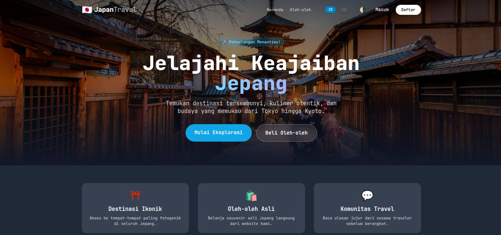

# Japan Travel

Portfolio-grade travel storefront untuk destinasi Jepang + toko souvenir, lengkap dengan admin dashboard modern, pembayaran nyata, dan UX bilingual (ID/EN).



**Fitur Utama**
- Public: listing destinasi, detail + ulasan, toko souvenir, cart, checkout, riwayat pesanan.
- Admin: dashboard KPI + charts, manajemen destinasi/souvenir, low-stock tooling, manajemen order + payment.
- Auth terpisah: guard user (web) dan guard admin, login admin via `/admin/login`.
- Payment production-ready: Midtrans Snap (Indonesia) + PayPal Checkout (internasional) dengan webhook + verifikasi signature + idempotency.
- i18n: auto-locale dari browser, toggle ID/EN, konten DB bilingual (spatie/laravel-translatable).
- Theme toggle: light/dark berbasis class, tersimpan di localStorage, tanpa flicker.
- Security: rate limiting login & webhook, security headers, session/cookie hardening, sesi admin terpisah.
- Performance: pagination, eager loading, caching listing, indeks DB untuk query populer.

**Teknologi**
- Laravel 12, Breeze, Tailwind CSS, Vite.
- MariaDB/MySQL.
- Midtrans Snap, PayPal Checkout.
- Chart.js.

**Persiapan Lokal**
1) Install dependency
```bash
composer install
npm install
```

2) Salin env
```bash
cp .env.example .env
php artisan key:generate
```

3) Atur database di `.env`
```env
DB_CONNECTION=mysql
DB_HOST=127.0.0.1
DB_PORT=3306
DB_DATABASE=japantravel
DB_USERNAME=root
DB_PASSWORD=
```

**Setup Database**
Opsi A (migrate + seed):
```bash
php artisan migrate --seed
```

Opsi B (import SQL demo):
```bash
mysql -u root -p japantravel < japantravel/japantravel.sql
```
Catatan: jika memakai opsi B, tidak perlu menjalankan `php artisan migrate` lagi.

**Akun Demo**
- Admin: `admin@japantravel.com` / `password`
- User: `kei@japantravel.com` / `password`

**Payment Setup (Sandbox)**
Tambahkan env berikut di `.env`:
```env
MIDTRANS_SERVER_KEY=your_midtrans_server_key
MIDTRANS_CLIENT_KEY=your_midtrans_client_key
MIDTRANS_IS_PRODUCTION=false

PAYPAL_CLIENT_ID=your_paypal_client_id
PAYPAL_CLIENT_SECRET=your_paypal_client_secret
PAYPAL_WEBHOOK_ID=your_paypal_webhook_id
PAYPAL_IS_PRODUCTION=false
PAYPAL_CURRENCY=USD
PAYPAL_EXCHANGE_RATE=15000
```

Webhook endpoints:
- Midtrans: `POST /payments/webhook/midtrans`
- PayPal: `POST /payments/webhook/paypal`

Untuk uji local, gunakan ngrok (contoh):
```bash
ngrok http 8000
```
Lalu set webhook URL ke `https://<ngrok-id>.ngrok-free.app/payments/webhook/...`

**i18n (ID/EN)**
- Auto-locale dari header browser.
- Toggle manual: `/lang/id` atau `/lang/en`.

**Menjalankan Aplikasi**
```bash
php artisan serve
npm run dev
```

Build produksi:
```bash
npm run build
php artisan serve
```

**Testing & Quality**
```bash
./vendor/bin/pint --test
./vendor/bin/phpstan analyse
php artisan test
composer audit
npm audit --audit-level=high
```
CI GitHub Actions menjalankan build, pint, phpstan, test, dan audit.

**Deployment Checklist**
- `APP_ENV=production`, `APP_DEBUG=false`, `SESSION_SECURE_COOKIE=true`.
- `php artisan storage:link`.
- `npm run build`.
- `php artisan optimize` + `config:cache`, `route:cache`, `view:cache`.
- Pastikan webhook Midtrans/PayPal mengarah ke domain production.
- Set `MIDTRANS_IS_PRODUCTION=true` dan `PAYPAL_IS_PRODUCTION=true`.

**Regenerasi SQL Demo**
```bash
php scripts/generate_demo_sql.php
```

## Lisensi
MIT (mengikuti lisensi bawaan Laravel).


