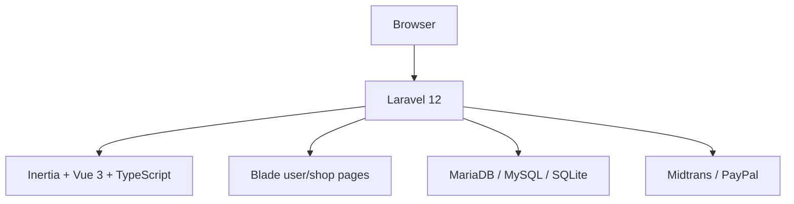

# Japan Travel

[](https://github.com/sulujulianto/japanesetravel/actions/workflows/ci.yml)
[](https://github.com/sulujulianto/japanesetravel/actions/workflows/security.yml)
[](https://www.php.net/)
[](https://laravel.com/)
[](https://vuejs.org/)
[](LICENSE)

**Bahasa Indonesia** · [English](README.en.md)

Japan Travel adalah aplikasi referensi full-stack untuk menemukan destinasi wisata Jepang dan membeli produk suvenir. Proyek ini dibangun sebagai modern monolith berbasis Laravel, Inertia, Vue, TypeScript, dan MariaDB, dengan perhatian khusus pada konsistensi transaksi, keamanan pembayaran, pemisahan akses pengguna/admin, serta bukti engineering yang dapat diverifikasi.

Layanan perjalanan bersifat **informasi dan pertanyaan melalui WhatsApp**. Aplikasi tidak menjual tiket atau memproses pemesanan perjalanan. Checkout dan pembayaran hanya berlaku untuk produk suvenir.

## Status Portofolio

| Area | Status |
|---|---|
| Demo lokal | Siap dijalankan dengan data demo terkurasi |
| Automated quality gates | Lulus pada commit `b2cff65` |
| PHPUnit | 258 tes, 2.498 assertion |
| CI database | SQLite, MariaDB 10.11, dan MariaDB 11.8 |
| Screenshot | 15 tampilan tersedia di [`docs/screenshots`](docs/screenshots) |
| Deployment publik | Ditunda; tidak diklaim sebagai aplikasi production-live |
| Payment provider | Struktur integrasi dan pengujian otomatis tersedia; validasi akun sandbox eksternal belum diklaim |

Repository ini diposisikan sebagai **proyek portofolio berorientasi production**, bukan bukti bahwa aplikasi telah menangani transaksi atau pengguna nyata. Seluruh keterbatasan operasional dicatat secara terbuka.

## Sorotan Utama

### Pengalaman publik dan pengguna

- Katalog destinasi bilingual Bahasa Indonesia/Inggris dengan pencarian, filter, pengurutan, jadwal, dan detail destinasi.
- Ulasan destinasi khusus pengguna terverifikasi dengan perlindungan duplikasi pada aplikasi dan database.
- Katalog suvenir, cart berbasis sesi, checkout, retry pembayaran, dan histori pesanan.
- Profil pengguna serta beberapa alamat pengiriman dengan pemilihan alamat utama.
- Tampilan responsif, mode terang/gelap, dan format angka/tanggal/harga sesuai locale.

### Operasional admin

- Login dan sesi admin terpisah dari sesi pengguna.
- Dashboard operasional untuk pendapatan, pesanan, stok, destinasi, suvenir, dan pengguna.
- CRUD destinasi dan suvenir dengan validasi media, konversi WebP, pembatasan dimensi, dan penghapusan aman.
- Filter serta transisi status order yang dibatasi oleh aturan domain.
- Inventory ledger yang mencatat restock, pengurangan, reservasi, dan pemulihan stok secara auditable.
- Direktori pengguna read-only beserta profil, alamat, dan histori pesanan yang relevan.

### Integritas transaksi dan pembayaran

- Row locking dan checkout token untuk mencegah overselling serta request checkout ganda.
- Gateway Midtrans Snap dan PayPal Checkout di balik kontrak driver bersama.
- Verifikasi signature/webhook, idempotency event, dan guarded state transitions.
- Validasi nominal, mata uang, dan referensi capture sebelum perubahan status finansial.
- Pemulihan stok exactly-once pada kegagalan pembayaran terminal atau pembatalan admin.
- Snapshot item, pelanggan, dan alamat pengiriman agar histori tetap terbaca setelah data sumber berubah atau akun dihapus.
- Payload provider dibatasi, disanitasi, dan memiliki kebijakan retensi untuk mengurangi paparan data sensitif.
- Native backed enums untuk status order, pembayaran, webhook, provider, dan role pengguna.

## Arsitektur


```mermaid
flowchart TD
    Browser["Browser"] --> Laravel["Laravel 12"]
    Laravel --> Vue["Inertia + Vue 3 + TypeScript"]
    Laravel --> Blade["Blade user/shop pages"]
    Laravel --> DB["MariaDB / MySQL / SQLite"]
    Laravel --> Gateway["Midtrans / PayPal"]
```

Pendekatan frontend bersifat **hibrida dan bertahap**:

- Beranda publik dan area admin menggunakan Inertia, Vue 3 Composition API, dan TypeScript.
- Katalog, autentikasi pengguna, cart, checkout, order, dan profil masih menggunakan Blade.
- Kedua jalur memakai sumber brand, locale, tema, dan aturan backend yang sama.
- Migrasi dilakukan per modul dengan contract test untuk membatasi risiko regresi.

Keputusan arsitektur penting:

- `app/Services/Payments/` memisahkan perilaku provider melalui interface dan driver.
- `app/Enums/` menjadi sumber nilai domain persisten dan aturan transisi.
- Guard serta nama cookie berbeda menjaga konteks login admin dan pengguna tetap independen.
- Mutasi stok dipusatkan pada transaksi dan inventory ledger.
- Snapshot terenkripsi memisahkan histori transaksi dari data profil yang dapat berubah.
- `app/Support/Format.php`, `Media.php`, dan `Brand.php` memusatkan concern presentasi yang digunakan lintas frontend.

Dokumentasi alur data dan state transition tersedia di [Dokumentasi Teknis Backend](docs/backend-technical-documentation.md).

## Teknologi

| Lapisan | Teknologi |
|---|---|
| Backend | PHP 8.3, Laravel 12 |
| Frontend modern | Inertia.js 3, Vue 3.5, TypeScript 5.9 |
| Frontend server-rendered | Blade dan JavaScript legacy terisolasi |
| Styling dan build | Tailwind CSS 3, Vite 7 |
| Database | MariaDB/MySQL; SQLite untuk quick review dan quality job CI |
| Pembayaran | Midtrans PHP SDK, PayPal REST integration |
| Observability/cache opsional | Sentry Laravel, Predis |
| Pengujian dan analisis | PHPUnit 11, Larastan/PHPStan level 6, Pint, ESLint, vue-tsc |
| CI dan keamanan | GitHub Actions, CodeQL, dependency review, secret scan, Composer/npm audit |
| Packaging | Multi-stage Dockerfile dan aset konfigurasi Railway |

Versi terkunci berada di `composer.lock` dan `package-lock.json`; badge di atas menunjukkan garis besar stack, bukan janji selalu menggunakan rilis mayor terbaru.

## Bukti Visual

| Pengalaman publik | Operasional admin |
|---|---|
|  |  |
|  |  |
|  |  |

Daftar lengkap 15 tampilan, termasuk checkout, tampilan mobile, dan dark mode, tersedia pada [panduan screenshot](docs/screenshots/README.md).

## Menjalankan Secara Lokal

### Kebutuhan

- PHP 8.3 atau lebih baru
- Composer 2
- Node.js 20 atau lebih baru dan npm
- MariaDB/MySQL, atau SQLite untuk review cepat
- Ekstensi PHP: `pdo_mysql` atau `pdo_sqlite`, `gd` dengan WebP, `fileinfo`, `curl`, `mbstring`, `openssl`, `xml`, dan `zip`
- `intl` disarankan; formatter menyediakan fallback deterministik

### Instalasi

```bash
git clone https://github.com/sulujulianto/japanesetravel.git
cd japanesetravel

composer install
npm ci
cp .env.example .env
php artisan key:generate
```

Untuk MariaDB/MySQL, siapkan database lalu sesuaikan `.env`:

```env
DB_CONNECTION=mysql
DB_HOST=127.0.0.1
DB_PORT=3306
DB_DATABASE=japantravel
DB_USERNAME=root
DB_PASSWORD=
```

Alternatif SQLite untuk review cepat:

```bash
touch database/database.sqlite
```

```env
DB_CONNECTION=sqlite
DB_DATABASE=/absolute/path/to/japanesetravel/database/database.sqlite
```

Siapkan aplikasi dan data demo lokal:

```bash
php artisan migrate --seed
php artisan db:seed --class=DevAccountSeeder
php artisan storage:link
npm run build
```

Jalankan aplikasi:

```bash
php artisan serve
```

Untuk pengembangan frontend, jalankan `npm run dev` pada terminal kedua.

> `DemoSeeder`, `DevAccountSeeder`, dan `migrate --seed` hanya untuk lingkungan lokal/testing. Seeder menolak eksekusi pada staging/production.

### Akun demo lokal

| Role | Email | Password | URL |
|---|---|---|---|
| Pengguna | `user.demo@japantravel.test` | `Password123!` | `/login` |
| Admin | `admin.demo@japantravel.test` | `Password123!` | `/admin/login` |

Dataset terkurasi berisi 10 destinasi, 10 suvenir, dan 15 ulasan. Kredensial tersebut hanya untuk data lokal/testing dan bukan akun pada layanan publik.

## Pengujian dan Quality Gates

Snapshot terverifikasi terakhir:

- Commit: [`b2cff65`](https://github.com/sulujulianto/japanesetravel/commit/b2cff650df07a41fd666e4da45bed490148f841b)
- PHPUnit: **258 tes, 2.498 assertion**
- PHPStan: tidak ada temuan baru di luar baseline yang diterima
- Vue TypeScript, ESLint, Pint, build produksi, Composer audit, dan npm audit: lulus
- CI: SQLite serta MariaDB 10.11/11.8
- Security workflow: CodeQL, dependency review, dan secret scan

Jalankan ulang seluruh pemeriksaan sebelum mengutip angka tersebut untuk commit lain:

```bash
composer validate --strict
composer audit --locked
npm audit --audit-level=high
npm run type-check
npm run lint
npm run build
php artisan test
vendor/bin/pint --test
vendor/bin/phpstan analyse --no-progress --memory-limit=1G
git diff --check
```

PHPStan menggunakan baseline yang tersimpan. Oleh karena itu, hasil hijau berarti tidak ada error di luar technical debt yang telah diterima—bukan berarti repository memiliki nol temuan laten. Angka lama tetap disimpan sebagai [bukti historis yang terikat commit](docs/qa/test-execution-evidence.md).

## Kontrol Keamanan

- Password hashing, CSRF protection, server-side authorization, dan validasi Form Request.
- Guard, cookie sesi, login, dan logout terpisah untuk pengguna serta admin.
- Rate limit pada login, ulasan, dan webhook.
- Email verification untuk tindakan pengguna yang sensitif.
- Query Eloquent/Query Builder terparameterisasi dan pembatasan mass assignment.
- Validasi file, konversi WebP, batas ukuran/dimensi, dan pembatasan direktori penghapusan.
- Data profil, alamat, serta snapshot pelanggan/alamat dienkripsi saat tersimpan.
- Idempotency dan verifikasi integritas pada checkout serta callback pembayaran.
- Header keamanan dan HTTPS enforcement untuk lingkungan nonlokal.
- Audit dependency, CodeQL untuk JavaScript/TypeScript, dan secret scanning dalam workflow GitHub.

Kontrol tersebut mengurangi risiko umum tetapi tidak menggantikan penetration test, validasi provider resmi, monitoring produksi, backup, atau pengujian operasional nyata.

## Dokumentasi

| Dokumen | Tujuan |
|---|---|
| [Indeks dokumentasi](docs/README.md) | Peta seluruh dokumentasi proyek |
| [Studi kasus](docs/case-study-japanese-travel.md) | Masalah, keputusan, trade-off, dan hasil |
| [Dokumentasi teknis backend](docs/backend-technical-documentation.md) | Model domain, transaksi, dan alur pembayaran |
| [Ringkasan pengujian](docs/testing-summary.md) | Cakupan, quality gates, dan keterbatasan pengujian |
| [Checklist kesiapan portofolio](docs/portfolio-readiness-checklist.md) | Bukti selesai dan pekerjaan manual tersisa |
| [Manual QA](docs/qa/manual-qa-checklist.md) | Pemeriksaan regresi berbasis pengguna |
| [Postman/API guide](docs/postman-api-checking.md) | Template pemeriksaan endpoint dan provider |
| [Design system](docs/design-system-and-rebranding.md) | Token UI, brand source, dan batas migrasi frontend |

## Batasan yang Diketahui

- Tidak ada deployment publik dan tidak ada klaim penggunaan production nyata.
- Midtrans/PayPal diuji dengan mock/contract pada automated tests; akun sandbox eksternal belum divalidasi.
- Pengujian email memverifikasi perilaku Laravel, bukan deliverability SMTP atau spam placement.
- Belum ada browser E2E, audit aksesibilitas, load test, atau performance budget otomatis.
- Tidak ada persentase code coverage karena driver PCOV/Xdebug tidak menjadi kebutuhan default.
- PHPStan masih memakai baseline untuk technical debt yang diketahui.
- Penyimpanan media lokal ditujukan untuk satu web replica; object storage belum diterapkan.
- Kurs konversi PayPal untuk IDR menggunakan nilai konfigurasi manual.
- Artefak Postman adalah template request, bukan bukti eksekusi terhadap provider eksternal.

## Roadmap Local-First

- Menyelesaikan manual regression QA pada lingkungan lokal yang terdokumentasi.
- Memperbarui screenshot setelah perubahan UI yang material.
- Merekam walkthrough 1–2 menit dari localhost jika diperlukan untuk portofolio.
- Meninjau pembaruan dependency secara selektif tanpa memaksakan major upgrade.
- Mengurangi PHPStan baseline secara bertahap dan mengukur coverage bila resource tersedia.
- Mempertahankan deployment, provider sandbox, transactional email, dan object storage sebagai peningkatan opsional berbasis akun eksternal.

## Lisensi

Proyek ini tersedia di bawah [MIT License](LICENSE).

## Pengembang

Dikembangkan oleh [Sulu Edward Julianto](https://github.com/sulujulianto) sebagai studi kasus full-stack dan bukti praktik engineering berbasis Laravel.
