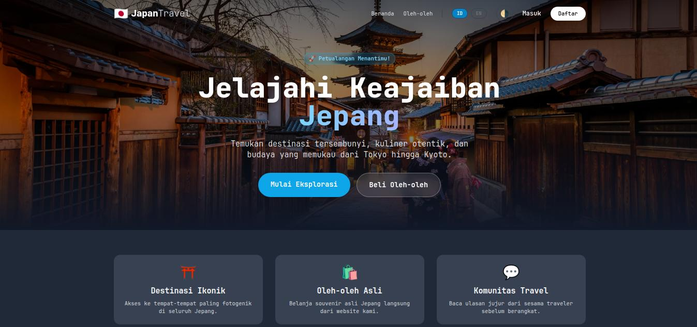

# Japan Travel

Portfolio-grade travel storefront untuk destinasi Jepang + toko souvenir, lengkap dengan admin dashboard modern, pembayaran nyata, dan UX bilingual (ID/EN).



**Fitur Utama**
- Public: listing destinasi, detail + ulasan, toko souvenir, cart, checkout, riwayat pesanan.
- Admin: dashboard KPI + charts, manajemen destinasi/souvenir, low-stock tooling, manajemen order + payment.
- Auth terpisah: guard user (web) dan guard admin, login admin via `/admin/login`.
- Payment production-ready: Midtrans Snap (Indonesia) + PayPal Checkout (internasional) dengan webhook + verifikasi signature + idempotency.
- i18n: auto-locale dari browser, toggle ID/EN, konten DB bilingual (spatie/laravel-translatable).
- Theme toggle: light/dark berbasis class, tersimpan di localStorage, tanpa flicker.
- Security: rate limiting login & webhook, security headers, session/cookie hardening, sesi admin terpisah.
- Performance: pagination, eager loading, caching listing, indeks DB untuk query populer.

**Teknologi**
- Laravel 12, Breeze, Tailwind CSS, Vite.
- MariaDB/MySQL.
- Midtrans Snap, PayPal Checkout.
- Chart.js.

**Persiapan Lokal**
1) Install dependency
```bash
composer install
npm install
```

2) Salin env
```bash
cp .env.example .env
php artisan key:generate
```

3) Atur database di `.env`
```env
DB_CONNECTION=mysql
DB_HOST=127.0.0.1
DB_PORT=3306
DB_DATABASE=japantravel
DB_USERNAME=root
DB_PASSWORD=
```

**Setup Database**

### Local fresh demo setup

Gunakan hanya pada database lokal yang boleh dihapus dan diisi ulang:

```bash
php artisan migrate --seed
```

`DatabaseSeeder` memanggil `DemoSeeder`, yang mengosongkan tabel aplikasi sebelum membuat data demo. Seeder ini dibatasi untuk environment `local`/`testing` dan tidak boleh digunakan pada staging atau production.

Alternatif import SQL demo lokal:

```bash
mysql -u root -p japantravel < japantravel/japantravel.sql
```

Jika memakai import SQL, tidak perlu menjalankan migrasi atau demo seeder lagi.

### Akun demo dari fresh demo setup

- Admin: `admin@japantravel.com` / `password`
- User: `kei@japantravel.com` / `password`

### Local visual-review accounts

Setelah data souvenir lokal tersedia, buat akun dan pesanan khusus visual review dengan:

```bash
php artisan db:seed --class=DevAccountSeeder
```

- Admin: `admin.demo@japantravel.test` / `Password123!`
- User: `user.demo@japantravel.test` / `Password123!`

`DevAccountSeeder` hanya ditujukan untuk visual review pada environment `local`/`testing`, tidak memanggil payment gateway, dan menolak environment lain.

### Production database setup

Jalankan migrasi tanpa demo seed:

```bash
php artisan migrate --force
```

Jangan menjalankan `php artisan migrate --seed`, `DemoSeeder`, `DevAccountSeeder`, atau mengimpor SQL demo pada database production.

**Payment Setup (Sandbox)**
Tambahkan env berikut di `.env`:
```env
MIDTRANS_SERVER_KEY=your_midtrans_server_key
MIDTRANS_CLIENT_KEY=your_midtrans_client_key
MIDTRANS_IS_PRODUCTION=false

PAYPAL_CLIENT_ID=your_paypal_client_id
PAYPAL_CLIENT_SECRET=your_paypal_client_secret
PAYPAL_WEBHOOK_ID=your_paypal_webhook_id
PAYPAL_IS_PRODUCTION=false
PAYPAL_CURRENCY=USD
PAYPAL_EXCHANGE_RATE=15000
```

Webhook endpoints:
- Midtrans: `POST /payments/webhook/midtrans`
- PayPal: `POST /payments/webhook/paypal`

Untuk uji local, gunakan ngrok (contoh):
```bash
ngrok http 8000
```
Lalu set webhook URL ke `https://<ngrok-id>.ngrok-free.app/payments/webhook/...`

**i18n (ID/EN)**
- Auto-locale dari header browser.
- Toggle manual: `/lang/id` atau `/lang/en`.

**Menjalankan Aplikasi**
```bash
php artisan serve
npm run dev
```

Build produksi:
```bash
npm run build
php artisan serve
```

**Testing & Quality**
```bash
./vendor/bin/pint --test
./vendor/bin/phpstan analyse
php artisan test
composer audit
npm audit --audit-level=high
```
CI GitHub Actions menjalankan build, pint, phpstan, test, dan audit.

**Dokumentasi Teknis Backend**
- Lihat dokumen lengkap: [`docs/backend-technical-documentation.md`](docs/backend-technical-documentation.md)

**Deployment Checklist**
- `APP_ENV=production`, `APP_DEBUG=false`, `SESSION_SECURE_COOKIE=true`.
- `php artisan storage:link`.
- `npm run build`.
- `php artisan optimize` + `config:cache`, `route:cache`, `view:cache`.
- Pastikan webhook Midtrans/PayPal mengarah ke domain production.
- Set `MIDTRANS_IS_PRODUCTION=true` dan `PAYPAL_IS_PRODUCTION=true`.

## Railway Deployment (No-Deploy Checklist)

Panduan ini untuk menyiapkan deployment Railway secara aman, tanpa menjalankan deploy otomatis dari aplikasi.

**1. Services yang disarankan**
- Web service: Dockerfile project ini.
- MySQL service: gunakan MySQL Railway agar konsisten dengan lokal MariaDB/MySQL.
- Optional worker service: untuk queue jika dipakai.
- Optional cron service: untuk scheduler jika dipakai.

**2. Start command per service**
- Web: `sh railway/start-web.sh`
- One-off migration (manual sebelum go-live): `sh railway/init-app.sh --migrate-only`
- Worker (optional): `sh railway/run-worker.sh`
- Cron (optional): `sh railway/run-cron.sh`

**3. Environment variables wajib (tanpa nilai secret)**
- App: `APP_NAME`, `APP_ENV`, `APP_KEY`, `APP_DEBUG`, `APP_URL`, `TRUSTED_PROXIES`
- Logging: `LOG_CHANNEL`, `LOG_STACK`, `LOG_LEVEL`
- Database: `DB_CONNECTION`, `DB_HOST`, `DB_PORT`, `DB_DATABASE`, `DB_USERNAME`, `DB_PASSWORD` (atau `DB_URL`)
- Session/cache/queue: `SESSION_DRIVER`, `SESSION_SECURE_COOKIE`, `CACHE_STORE`, `QUEUE_CONNECTION`
- Storage: `FILESYSTEM_DISK`, `MEDIA_DISK`
- Mail: `MAIL_MAILER`, `MAIL_HOST`, `MAIL_PORT`, `MAIL_USERNAME`, `MAIL_PASSWORD`, `MAIL_FROM_ADDRESS`, `MAIL_FROM_NAME`
- Payment Midtrans: `MIDTRANS_SERVER_KEY`, `MIDTRANS_CLIENT_KEY`, `MIDTRANS_IS_PRODUCTION`
- Payment PayPal: `PAYPAL_CLIENT_ID`, `PAYPAL_CLIENT_SECRET`, `PAYPAL_WEBHOOK_ID`, `PAYPAL_IS_PRODUCTION`, `PAYPAL_CURRENCY`, `PAYPAL_EXCHANGE_RATE`
- Monitoring: `SENTRY_LARAVEL_DSN` (+ optional `SENTRY_ENVIRONMENT`, `SENTRY_RELEASE`, `SENTRY_TRACES_SAMPLE_RATE`)

**4. Production baseline env**
- `APP_ENV=production`
- `APP_DEBUG=false`
- `SESSION_SECURE_COOKIE=true`
- `TRUSTED_PROXIES=*`
- `LOG_CHANNEL=stack`
- `LOG_STACK=stderr`

**5. Migration / seed strategy**
- Jalankan migrasi dengan `--force` via one-off command (`sh railway/init-app.sh --migrate-only`).
- Command production setara adalah `php artisan migrate --force` tanpa opsi `--seed`.
- Jangan menjalankan `DatabaseSeeder`, `DemoSeeder`, `DevAccountSeeder`, atau import SQL demo pada production.
- `DatabaseSeeder` hanya mengisi demo data pada environment `local`/`testing`.
- `DevAccountSeeder` hanya untuk visual review pada environment `local`/`testing` dengan credential publik yang terdokumentasi.

**6. Storage / media upload**
- Saat ini media menggunakan disk lokal/public (`MEDIA_DISK=public`), yang bersifat ephemeral di container Railway.
- Opsi sementara: mount Railway Volume ke path storage yang sesuai.
- Opsi production-ready: gunakan object storage (`FILESYSTEM_DISK=s3`) dengan env `AWS_*`.

**7. Verifikasi sebelum deploy**
```bash
composer validate
composer audit
./vendor/bin/phpstan analyse --no-progress
php artisan test
npm ci
npm run build
```

**Regenerasi SQL Demo**
```bash
php scripts/generate_demo_sql.php
```

## Lisensi
MIT (mengikuti lisensi bawaan Laravel).
